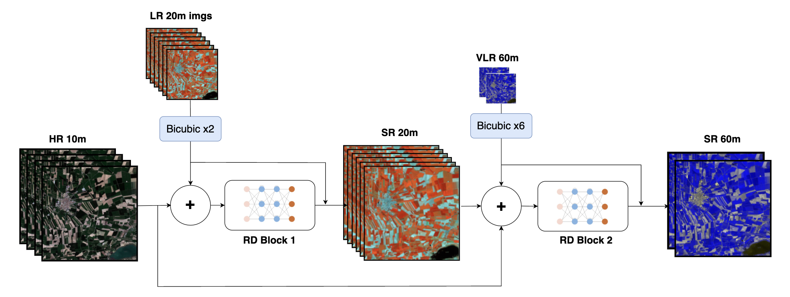
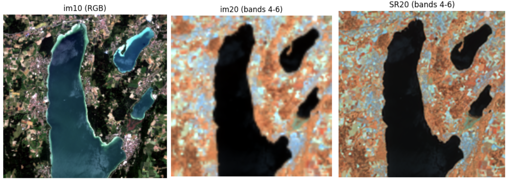
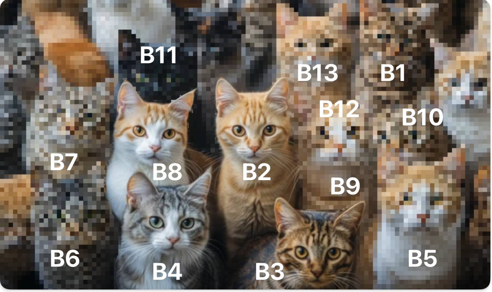

<h1 align=center> Sentinel-2 Super-Resolution </h1>

<div align="center">



*Sen2-RDSR (Sentinel-2 Residual Dense Super-Resolution)*

</div>

## Motivation
High spatial resolution is essential for precise land cover classification and vegetation monitoring. However, not all bands provided by [Sentinel-2](https://www.esa.int/Applications/Observing_the_Earth/Copernicus/Sentinel-2) have high resolution. By leveraging the spatial and structural information from the high-resolution bands, the low-resolution bands can be super-resolved. This is possible under the assumption that all images are self-similar and scale-invariant.

## Overview

This project implements **single-image super-resolution** for Sentinel-2 satellite imagery using **Residual Dense Convolutional Neural Networks (RDCNNs)**. The goal is to enhance the spatial resolution of Sentinel-2's lower-resolution spectral bands (20m and 60m) by leveraging information from the higher-resolution 10m bands.

## Quick Start
[](https://colab.research.google.com/github/MrJJimenez/Super-Resolution-of-Sentinel-2-Low-Resolution/blob/main/training/training.ipynb)

> **_NOTE_**: This project is still in progress.



*Super-resolution example of the 20m/px bands of Lake Ammersee in Germany*

### Key Features
- **Multi-scale super-resolution**: Enhances 20m → 10m and 60m → 10m bands
- **Deep learning approach**: Uses residual dense blocks for feature extraction
- **Real satellite data**: Works with actual Sentinel-2 MSIL1C products
- **Research reproduction**: Replicates results from peer-reviewed scientific paper



## Research Background

This implementation reproduces the methodology from:
> **"Single-Image Super-Resolution of Sentinel-2 Low Resolution Bands with Residual Dense Convolutional Neural Networks"**  
> Published in *Remote Sensing* journal  
> [Read the paper](https://www.mdpi.com/2072-4292/13/24/5007)


### Environment Setup
```bash
conda activate sent2env
```

### Basic Usage
```bash
# Create training patches
python training/create_patches.py [path_to_SAFE_directory]

# Train the model on google colab
jupiter notebook training/training.ipynb


## About Sentinel-2

Sentinel-2 satellites provide multispectral imagery with different spatial resolutions:
- **10m bands**: B2, B3, B4, B8 (visible + NIR)
- **20m bands**: B5, B6, B7, B8A, B11, B12 (vegetation + SWIR)  
- **60m bands**: B1, B9, B10 (atmospheric + cirrus)

This project enhances the lower resolution bands to match the 10m spatial detail.