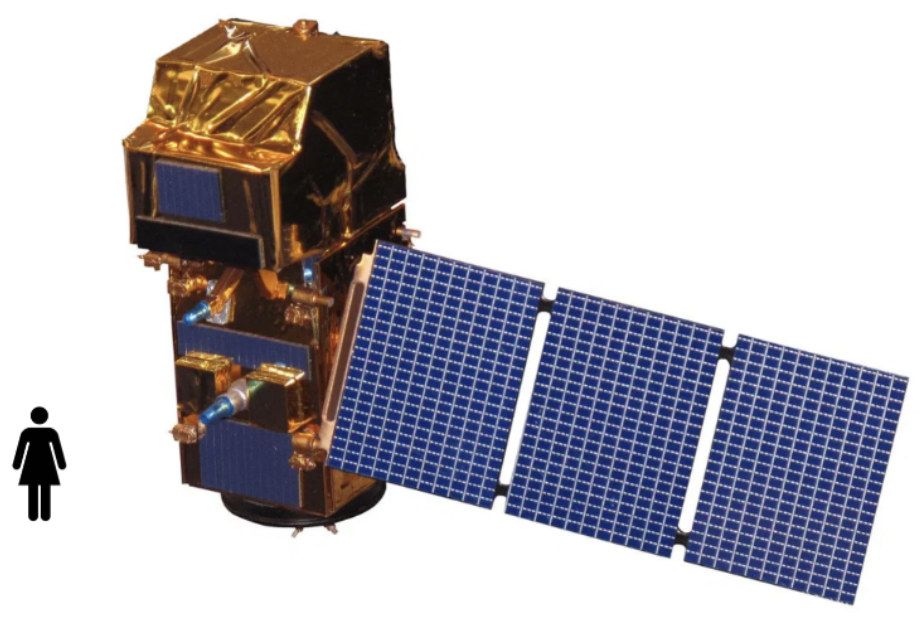

# Sentinel-2 Super-Resolution with Residual Dense CNNs 🛰️

<div align="center">


*Super-resolution example of the 20m/px bands of Lake Ammersee in Germany*



*Enhanced resolution satellite imagery through deep learning*

</div>

## 🔍 Overview

This project implements **single-image super-resolution** for Sentinel-2 satellite imagery using **Residual Dense Convolutional Neural Networks (RDCNNs)**. The goal is to enhance the spatial resolution of Sentinel-2's lower-resolution spectral bands (20m and 60m) by leveraging information from the higher-resolution 10m bands.

### Key Features
- 🎯 **Multi-scale super-resolution**: Enhances 20m → 10m and 60m → 10m bands
- 🧠 **Deep learning approach**: Uses residual dense blocks for feature extraction
- 📡 **Real satellite data**: Works with actual Sentinel-2 MSIL1C products
- 🔬 **Research reproduction**: Replicates results from peer-reviewed scientific paper


## 📚 Research Background

This implementation reproduces the methodology from:
> **"Single-Image Super-Resolution of Sentinel-2 Low Resolution Bands with Residual Dense Convolutional Neural Networks"**  
> Published in *Remote Sensing* journal  
> 🔗 [Read the paper](https://www.mdpi.com/2072-4292/13/24/5007)

## 🚀 Quick Start

### Environment Setup
```bash
conda activate sent2env
```

### Basic Usage
```bash
# Create training patches
python training/create_patches.py [path_to_SAFE_directory]

# Train the model on google colab
jupiter notebook training/training.ipynb


## 🛰️ About Sentinel-2

Sentinel-2 satellites provide multispectral imagery with different spatial resolutions:
- **10m bands**: B2, B3, B4, B8 (visible + NIR)
- **20m bands**: B5, B6, B7, B8A, B11, B12 (vegetation + SWIR)  
- **60m bands**: B1, B9, B10 (atmospheric + cirrus)

This project enhances the lower resolution bands to match the 10m spatial detail.